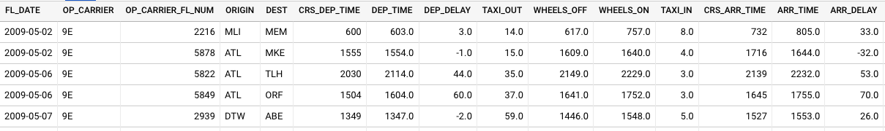
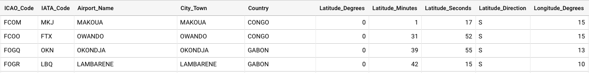

While going through the variables of the dataset, I realized that I could get some insightful answers for questions like what are the major reasons of cancellation/delay of flights, which region is mostly affected, is there any specific period when cancellations/delays happen the most, is the amount of cancellation/ delay distributed equally nationwide or does that change regions-wise, what reasons led to delay/cancellations region-wise, etc.

If answers to such questions could be answered, this might help governments, airport authorities, airline organizations, or third party businesses who provide services on platforms built by airport and airline industries like advertising agencies and infotainment system providers to make smart decisions while providing any service to customers.
The government could choose locations with the least delaying/ canceling factors to build the busiest airport in their country. With more footfall on such airports, airport authorities could make more revenue allowing more and more airlines willing to land their flights at such a big airport. With such humongous/ mammoth footfall advertising agencies could throw more advertisements to customers.

### About the Data:
---
The main dataset has been sourced from [Kaggle](https://www.kaggle.com/yuanyuwendymu/airline-delay-and-cancellation-data-2009-2018). Additional data with Aiport metadata has also been fetched from Partow [(The Global Airport Database)](https://www.partow.net/miscellaneous/airportdatabase/). Only relevant information will be provided for the latter due to low importance in the report.

The main dataset i.e. [Airline Cancellation/Delay (2009-2018)](https://www.kaggle.com/yuanyuwendymu/airline-delay-and-cancellation-data-2009-2018) was fetched in the form of multiple CSV files each representing data for each year. Overall, it was nearly 7 GB in size with nearly 68 million rows, comprising of the following fields/columns:

#### Fields (Airline Cancellation/Delay (2009-2018) dataset):

#### Fields (The Global Airport Database dataset):

**Name**|**Type**|**Example**
:-----:|:-----:|:-----:
ICAO Code |(3-4 chars, A - Z)|KATL
IATA Code |(3 chars, A - Z)|ATL
Airport Name |String|THE WILLIAM B HARTSFIELD ATLANTA INTERNATIONAL
City/Town |String|ATLANTA
Country |String|USA
Latitude Degrees |Integer [0,360]|33
Latitude Minutes |Integer [0,60]|38
Latitude Seconds |Integer [0,60]|25
Latitude Direction |Char (N or S)|N
Longitude Degrees |Integer [0,360]|84
Longitude Minutes |Integer [0,60]|25
Longitude Seconds |Integer [0,60]|37
Longitude Direction |Char (E or W)|W
Altitude (Altitude in meters from mean sea level)|Integer [-99999,+99999]|313
Latitude Decimal Degrees |Floating point [-90,90]|33.64
Longitude Decimal Degrees|Floating point [-180,180]|-84.427

#### Fields Preview (Main Dataset):

Set 1: 15/27 columns

Set 2: Remaining 12/27 columns

Fields Preview (Auxillary Dataset):

#### Fields Graph:

The following shows the relation between columns:

## Future Work