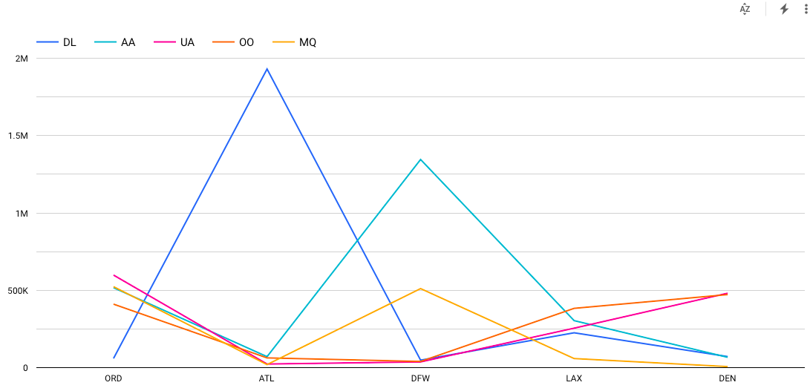
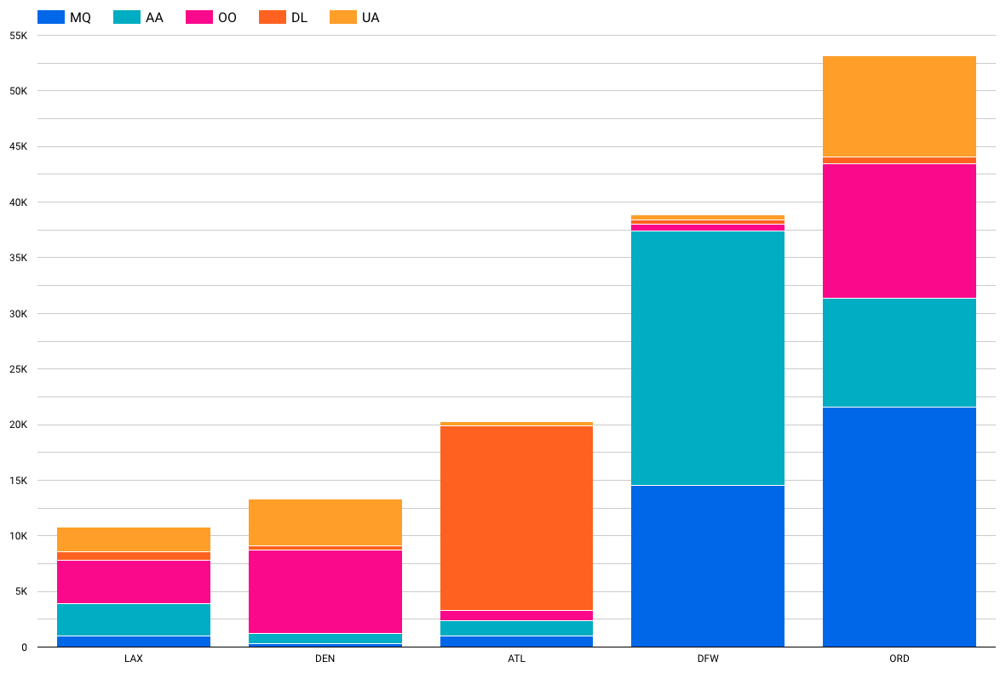
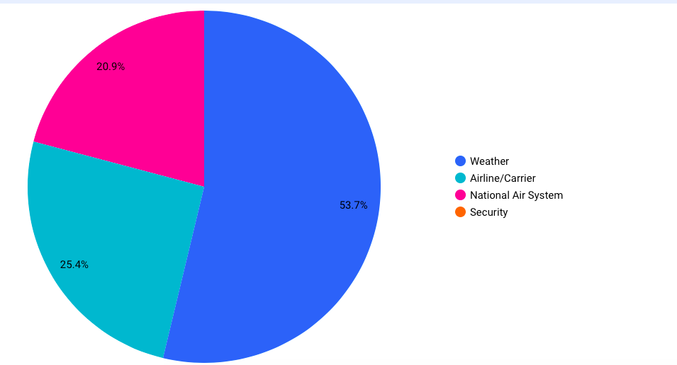
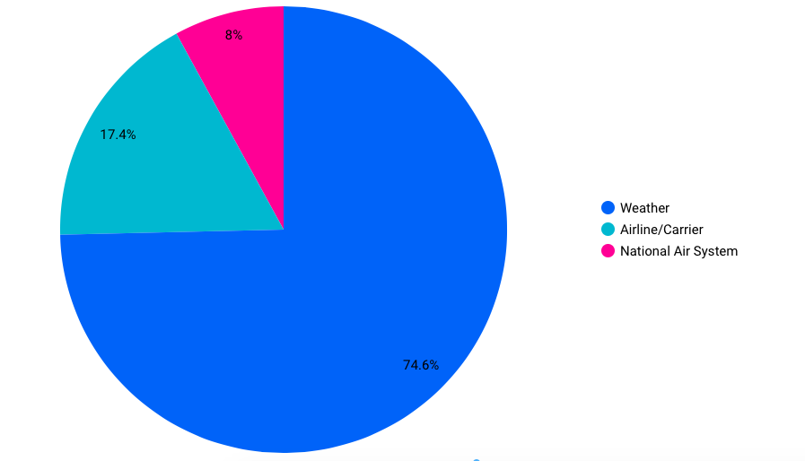
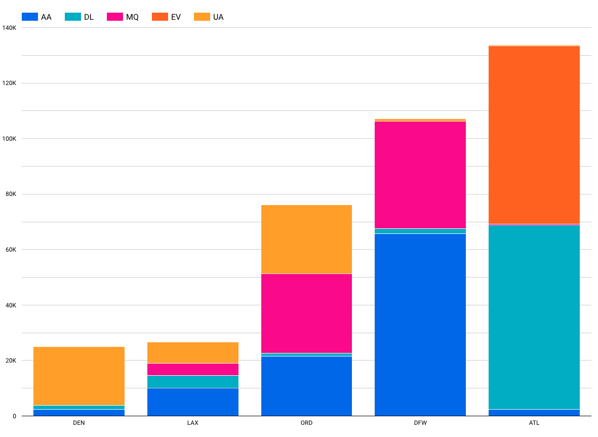
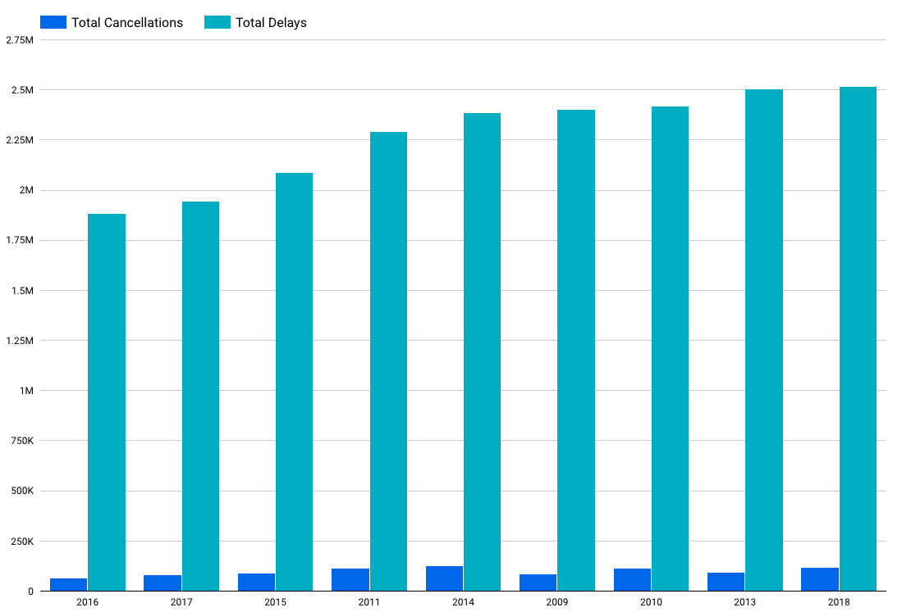
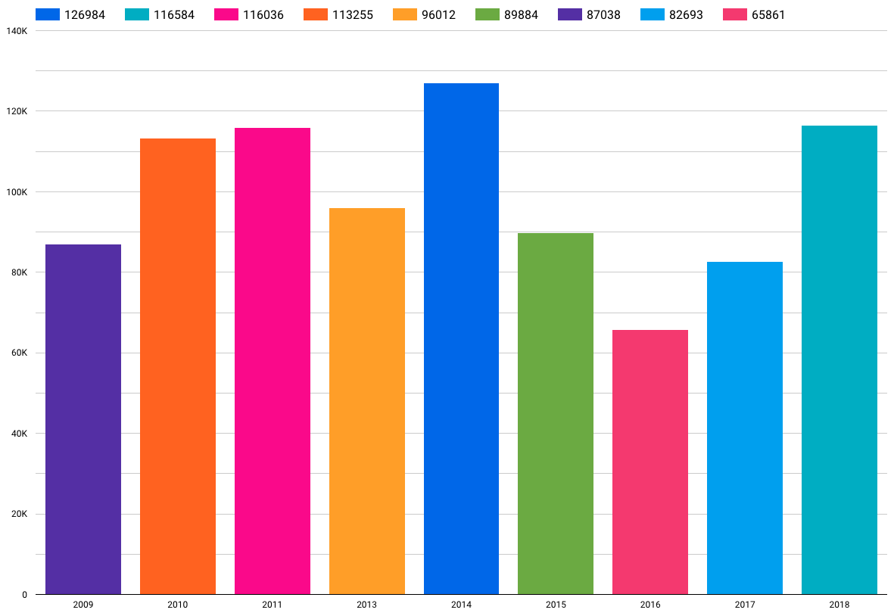
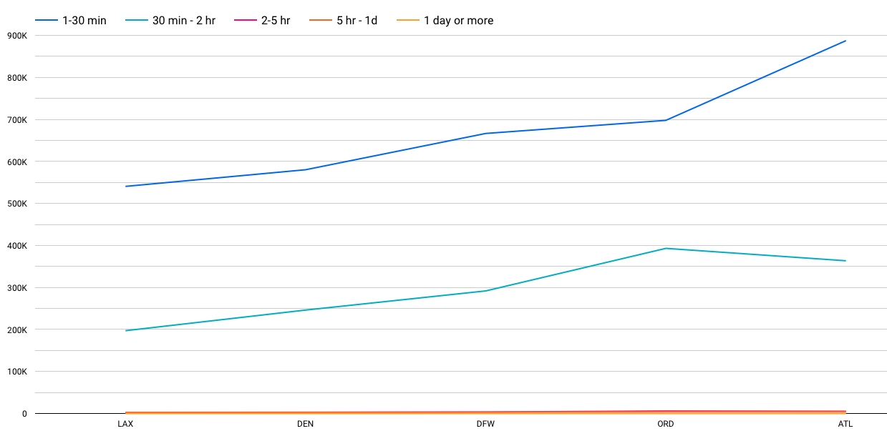
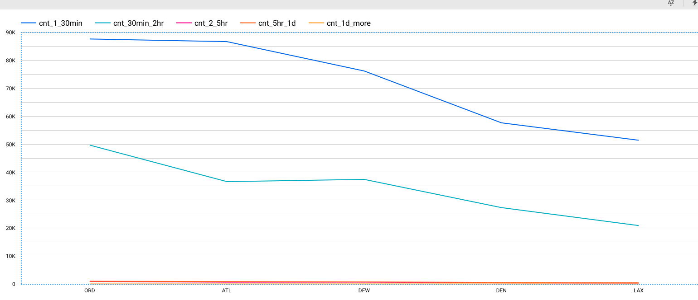
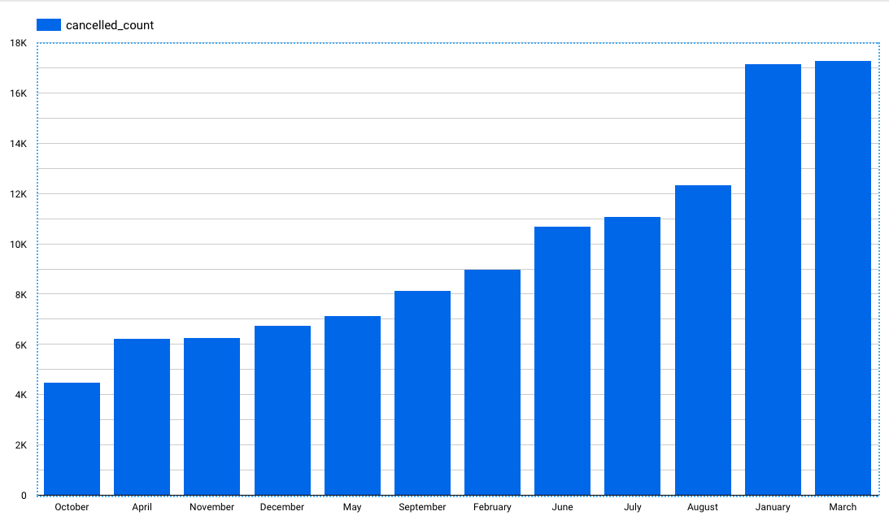

# Data Analysis:

While going through the variables of the dataset, it was realized that the solutions for the following questions could be obtained by analyzing the dataset:

-  What are the major busiest airports with maximun flight arrivals
-  What are the major reasons for delays and cancellations at the busiest airports
-  Is the major reason for flight delays same as the major reason for cancellations
-  Is there a specific period (specific months) when cancellations/delays happen the most
-  Is the amount of delays and cancellations distributed equally nationwide. If not, which regions are majorly affected.

#### Analysis

- An in-depth analysis was carried out to obtain the following insights from the data.

#### Flight count from Top 5 Airlines at Top 5 Airports

#### Top 5 Airports with maximum flight count
1. **ORD** (O'Hare International Airport)
2. **ATL** (Hartsfield-Jackson Atlanta International Airport)
3. **DFW** (Dallas/Fort Worth International Airport)
4. **LAX** (Los Angeles International Airport)
5. **DEN** (Denver International Airport)

#### Top 5 Airlines with maximum flight count
1. **DL** (Delta Air Lines)
2. **AA** (American Airlines)
3. **UA** (United Airlines)
4. **OO** (SkyWest Airlines)
5. **MQ** (American Eagle Airlines)

 

## Top 5 Airports with Maximum Cancellations (decreasing order)
S No.| Airport Code | Airport Name | Cancellation (in %) |
- | - | - | - | -
| 1. | **ORD** | (O'Hare International Airport) | 39|
| 2. | **DFW** | (Dallas/Fort Worth International Airport) | 28.5|
| 3. | **ATL** | (Hartsfield-Jackson Atlanta International Airport) | 14.9|
| 4. | **DEN** | (Denver International Airport) | 9.8|
| 5. | **LAX** | (Los Angeles International Airport) | 7.9|

 
  
## Cancellation Bifircation

 
 

## Top Cancellation Reasons in Top 5 Busiest Airports

S No.| Reason | Cancellation (in %) |
| - | - | - | -
| 1. | **Weather** | 53.7|
| 2. | **Airline/Carrier Delays** | 25.4|
| 3. | **National Air System** | 20.9|
| 4. | **Airport Secutiy** | 0.01 (~ 0)|
 
 

 
 
 

## Top Cancellation Reasons at the Most Busiest Airport (Atlanta)

S No.| Reason | Cancellation (in %) |
| - | - | - | -
| 1. | **Weather** | 74.6|
| 2. | **Airline/Carrier Delays** | 17.4|
| 3. | **National Air System** | 8|
 

 
 

- #### Overall Delays in Top 5 Airports with top 5 airlines

 
 

---
> ### Next we find out the time perid with maximum delays and cancellations

---
## Overall Cancellation/Delays Yearwise

 
 

## Overall Yearwise Cancellations

|S No.| Year | Cancellations (in thousand) |
| - | - | - | -
| 1. |2009 | 87 |
| 2. | 2010 | 113|
| 3. |2011| 116|
| 4. |2012|93|
| 5. |2013 | 96|
| 6. |2014 | 126|
| 7. |2015 | 89|
| 8. |2016 | 65|
| 9. |2017 | 82|
| 10. |2018 | 116|

 

## Overall Delay Time Frequency with Top 5 Airports (2009-2018)

 

> We realize that 2018 is the year of maximum delays and cancellations

 

---

- Delay Percentage for top 5 airports (2009-2018)

---

- Delay Percentage for top 5 airports (2018) (Year of max delays and cancellations)

- Most unreliable month in 2018 (Cancellations in ascending order)

## Future Work

- #### Weather Data
    The weather data for each of the major airports could be obtained and combined with the existing datasets. 
    With the new dataset, one could determine the exact weather conditions that resulted in delay/cancalltions.
    
    Also, what major weather conditions like rain, fog, etc result in more delays and cancellations than other ones.

 ingested in BigQuery while visualization has been carried in . 

    

        
    

    
 
        
    

