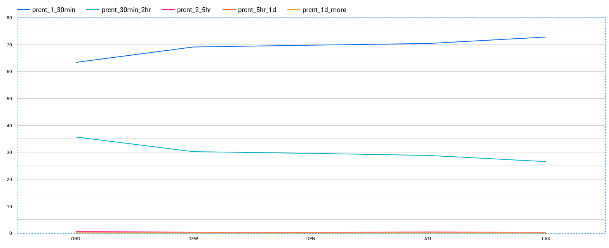

# Data Analysis:

While going through the variables of the dataset, I realized that I could get some insightful answers for questions like what are the major reasons of cancellation/delay of flights, which region is mostly affected, is there any specific period when cancellations/delays happen the most, is the amount of cancellation/ delay distributed equally nationwide or does that change regions-wise, what reasons led to delay/cancellations region-wise, etc.

If answers to such questions could be answered, this might help governments, airport authorities, airline organizations, or third party businesses who provide services on platforms built by airport and airline industries like advertising agencies and infotainment system providers to make smart decisions while providing any service to customers.
The government could choose locations with the least delaying/ canceling factors to build the busiest airport in their country. With more footfall on such airports, airport authorities could make more revenue allowing more and more airlines willing to land their flights at such a big airport. With such humongous/ mammoth footfall advertising agencies could throw more advertisements to customers.

## Future Work

A lot of extensive analysis has been carried out to gain insights from the data ingested in BigQuery while visualization has been carried in Google Data Studio. 

- Overall flight count from Top 5 Airlines at Top 5 Airports

---

- Cancellations Pie Chart

---

- Overall Cancellations in Top 5 Airports 

---

- Overall Delay in Top 5 Airports

 
---

- Overall Cancellation/Delays Yearwise

---
- Overall Yearwise Cancellations

---

- Overall Cancellation Reasons

---

- Overall Cancellation Reasons (Busiest Airport - Atlanta)

---

- Delay Count (2009-2018)

---

- Delay Count (2018) (Year of max delays and cancellations)

---

- Delay Percentage for top 5 airports (2009-2018)

---

- Delay Percentage for top 5 airports (2018) (Year of max delays and cancellations)

- Most unreliable month in 2018 (Cancellations in ascending order)

    

        
    

    
 
        
    

