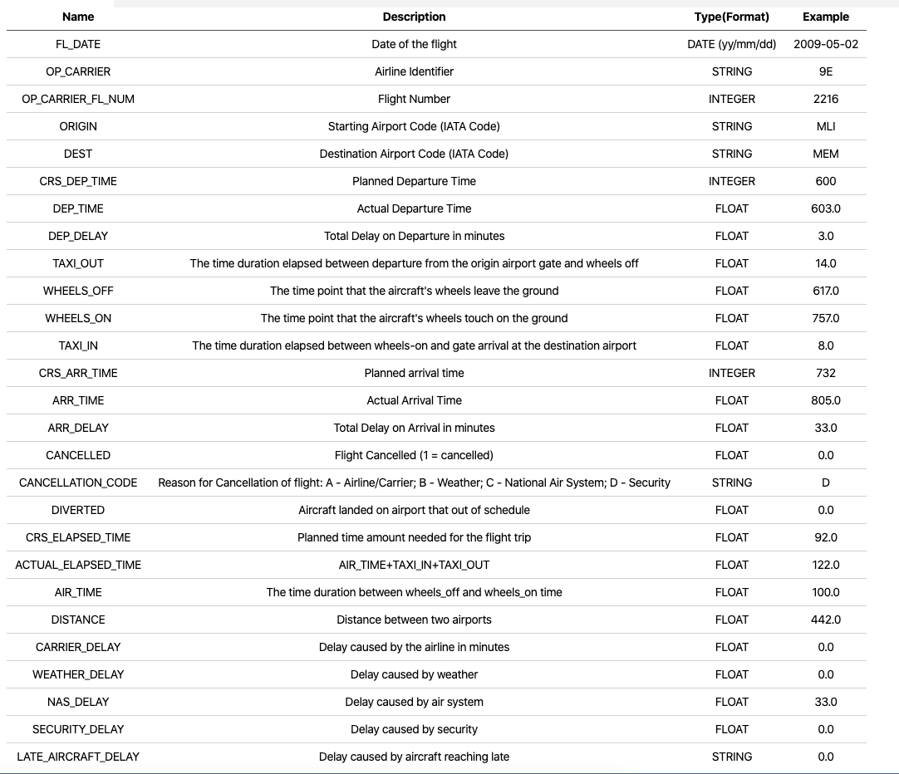
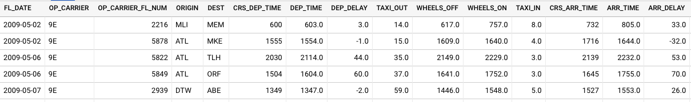
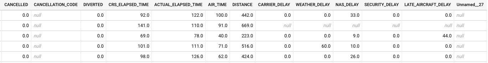
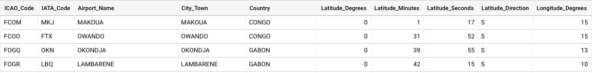
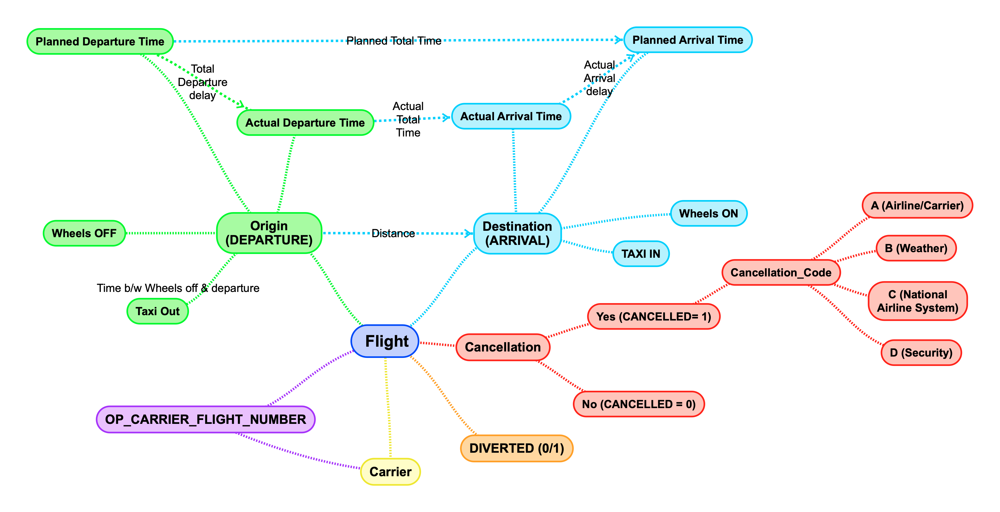

# Motivation:

The global aviation industry in one of the biggest industries by revenue in 2020. 
According to a <a href="https://www.forbes.com/sites/jamesasquith/2020/04/06/if-aviation-was-a-country-it-would-be-the-worlds-20th-largest-by-gdp/#75a00acde5b5" target="_blank">Forbes report</a>, 
if Aviation was a country, it would have been the World’s 20th largest By GDP. 
It supports nearly $2.7 trillion in world economic activity (3.6% of global gross domestic product of the world)<sup>[[1]](https://aviationbenefits.org/economic-growth/adding-value-to-the-economy/) </sup> every year. 
As per 
<a href="https://www.icao.int/annual-report-2018/Pages/the-world-of-air-transport-in-2018.aspx" target="_blank">ICAO’s preliminary compilation of annual global statistics</a>,
, the total number of passengers carried on scheduled services rose to 4.3 billion in 2018, 
which is 6.4 per cent higher than the previous year, while the number of departures reached 37.8 million 
in 2018, a 3.5 per cent increase.

As per AviationOutlook, the overall worldwide revenue rose from $754 billion 
in 2017 to $824 billion in 2018 (+9.4% growth), in which the North America provided a
significant contribution.

The North America contributed 22.4 per cent of world traffic in 2018
<sup>[[2]](https://aviationbenefits.org/economic-growth/adding-value-to-the-economy/) </sup>.
In 2018, North America's RPK (Revenue passenger-Kilometres) was 39.9 per cent of total RPK, posting growth of 5.2 per cent.
 
The aviation industry plays major role in the global commerce, than just tourism. As per <a href="(https://www.investopedia.com/ask/answers/041315/how-much-revenue-airline-industry-comes-business-travelers-compared-leisure-travelers.asp">Investopedia</a>,
the big money that comes from business travelers outweights to those flying for leisure or personal reasonsas business passengers represent 75% of an airline's profits, on some flights.

While the aviation industry in growing rapidly on a per year basis, their incurred losses are still high. 
One of the major contrbutors in these losses are the delays and cancellations occured every hour. 
Any minor or major flight delay or cancellation results in loss of thousands to 
millions of dollars in revenues annually for both Airports as well as Airlines. 

Thus for my project, I chose the [Kaggle dataset](https://www.kaggle.com) 
that provided data points for the Delays and Cancellations for the time period of 
2009 through 2018. As this dataset is very recent, one could get a real picture of 
a very recent period.

<div style="text-align: right;display: inline;cursor:pointer;float: right;right: -6px;" align="right"> 
    <a href="report"></a>
</div>

While going through the variables of the dataset, I realized that I could get some insightful answers for questions like what are the major reasons of cancellation/delay of flights, which region is mostly affected, is there any specific period when cancellations/delays happen the most, is the amount of cancellation/ delay distributed equally nationwide or does that change regions-wise, what reasons led to delay/cancellations region-wise, etc.

If answers to such questions could be answered, this might help governments, airport authorities, airline organizations, or third party businesses who provide services on platforms built by airport and airline industries like advertising agencies and infotainment system providers to make smart decisions while providing any service to customers.
The government could choose locations with the least delaying/ canceling factors to build the busiest airport in their country. With more footfall on such airports, airport authorities could make more revenue allowing more and more airlines willing to land their flights at such a big airport. With such humongous/ mammoth footfall advertising agencies could throw more advertisements to customers.
### References
 1. $2.7 trillion in world economic activity : https://aviationbenefits.org/economic-growth/adding-value-to-the-economy/
 2. 22.4 per cent of world traffic was from  : https://www.icao.int/annual-report-2018/Pages/the-world-of-air-transport-in-2018.aspx


### About the Data:
---
The main dataset has been sourced from [Kaggle](https://www.kaggle.com/yuanyuwendymu/airline-delay-and-cancellation-data-2009-2018). Additional data with Aiport metadata has also been fetched from Partow [(The Global Airport Database)](https://www.partow.net/miscellaneous/airportdatabase/). Only relevant information will be provided for the latter due to low importance in the report.

The main dataset i.e. [Airline Cancellation/Delay (2009-2018)](https://www.kaggle.com/yuanyuwendymu/airline-delay-and-cancellation-data-2009-2018) was fetched in the form of multiple CSV files each representing data for each year. Overall, it was nearly 7 GB in size with nearly 68 million rows, comprising of the following fields/columns:


#### Fields (Airline Cancellation/Delay (2009-2018) dataset):


#### Fields (The Global Airport Database dataset):

**Name**|**Type**|**Example**
:-----:|:-----:|:-----:
ICAO Code |(3-4 chars, A - Z)|KATL
IATA Code |(3 chars, A - Z)|ATL
Airport Name |String|THE WILLIAM B HARTSFIELD ATLANTA INTERNATIONAL
City/Town |String|ATLANTA
Country |String|USA
Latitude Degrees |Integer [0,360]|33
Latitude Minutes |Integer [0,60]|38
Latitude Seconds |Integer [0,60]|25
Latitude Direction |Char (N or S)|N
Longitude Degrees |Integer [0,360]|84
Longitude Minutes |Integer [0,60]|25
Longitude Seconds |Integer [0,60]|37
Longitude Direction |Char (E or W)|W
Altitude (Altitude in meters from mean sea level)|Integer [-99999,+99999]|313
Latitude Decimal Degrees |Floating point [-90,90]|33.64
Longitude Decimal Degrees|Floating point [-180,180]|-84.427

#### Fields Preview (Main Dataset):

Set 1: 15/27 columns


Set 2: Remaining 12/27 columns


Fields Preview (Auxillary Dataset):


#### Fields Graph:

The following shows the relation between columns:


### Obtaining the Data & Preprocessing
---
- #### Obtaining the Data: 
Each CSV file was downloaded individually and kept in local storage unless uploaded to the cloud.
- #### Preprocessing:
As the sourced data was already cleaned and formatted, no preprocessing was involved.

### Storage :
---
Each CSV file is nearly 700 MB in size. Such large size CSVs cannot be uploaded directly to BigQuery. So, GCS was involved as an intermediate data storage. The GCS bucket that was used : `gs://personal-pr.` 
The following command has been used:
```
gsutil cp <source_to_CSV_dir>/*.csv gs://personal-pr
```

The data points for the two datasets have been stored in two separate tables in BigQuery with the table’s schema being autogenerated. 
For the main dataset, CSVs were appended to the same table to form the final table.

### Data Analysis:

A lot of extensive analysis has been carried out to gain insights from the data ingested in BigQuery while visualization has been carried in Google Data Studio. 


- Overall flight count from Top 5 Airlines at Top 5 Airports


---

- Cancellations Pie Chart


---

- Overall Cancellations in Top 5 Airports 


---

- Overall Delay in Top 5 Airports

 
---

- Overall Cancellation/Delays Yearwise


---
- Overall Yearwise Cancellations


---

- Overall Cancellation Reasons


---

- Overall Cancellation Reasons (Busiest Airport - Atlanta)


---

- Delay Count (2009-2018)


---

- Delay Count (2018) (Year of max delays and cancellations)


---

- Delay Percentage for top 5 airports (2009-2018)


---

- Delay Percentage for top 5 airports (2018) (Year of max delays and cancellations)


- Most unreliable month in 2018 (Cancellations in ascending order)


#### Software Specifications:

- Choosing BigQuery : With such large data, obtaining results for even a small query takes nearly a minute or two in other database management systems. For complex queries, it might result in consuming 2-5 minutes. Such a huge latency might act as hurdles in business operations.
While viewing real-time dashboards, It may jeopardize user experience and as a result, reduce user retention overall. While querying data for APIs, such long time will lead in losing customers.

## Future Work

### Glossary:

- **Taxi Out:** The flight attendants make sure the cabin is ready for takeoff and do conduct the emergency brief before takeoff. The pilots start the engines and request permission to taxi. While it seems that this is a relatively easy phase of your flight, its' anything but, especially when it is a very busy airport, a lot of aircraft taxing around, maybe reduced visibility. This time taken is called Taxi Out.
- **Taxi In:** Similar to Taxi Out, there is a definite amount of time from the airplane landing on the runway till the time it rests at the final stop before passengers are allowed to move out of the plan. This time taken is called Taxi In.
- **ICAO Code:** The ICAO airport code or location indicator is a four-letter code designating aerodromes around the world. (not using this one)
- **IATA Code:** An IATA airport code, also known as an IATA location identifier, IATA station code or simply a location identifier, is a three-letter geocode designating many airports and metropolitan areas around the world, defined by the International Air Transport Association (IATA)

### Summary:

After analyzing the data, a lot of insights have been generated. Most of the delays and cancellations are due to three major reasons:
- Weather
- Airline/Carrier Issues
- National Air System